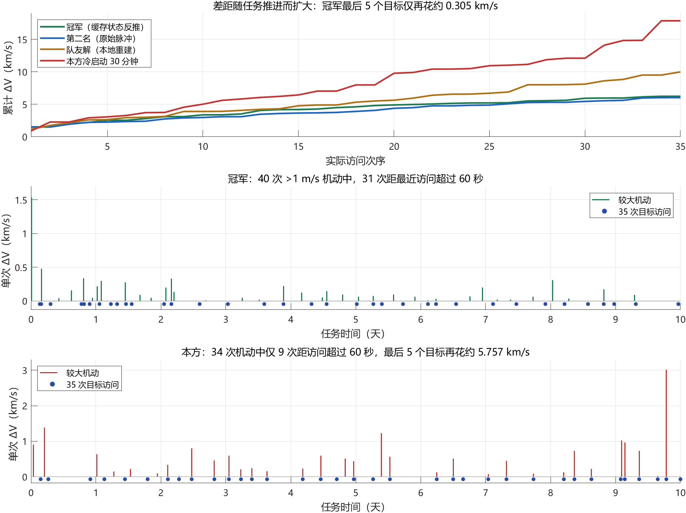

# CTOC14 乙组赛后复盘：冠军轨迹与本方搜索的差距

2026-09-28。用户要求比赛结束后对照公开冠军解找差距，并确认“冠军是时间奖励更多，亚军的 ΔV 更低”。因此本项目以原始 ΔV 为目标时，优先以亚军 6.034669 km/s 作技术对照，冠军 6.234193 km/s 作另一种优质轨迹结构的参照。本轮仅离线读取公开文件、做必要固定控制数值诊断、审查当前搜索路径和归档；没有启动优化搜索、没有接入冠军作为搜索初值、没有启动 ATK，没有修改生产求解器。

## 1. 结论

**V3/V4 的正式物理模型可以容纳冠军；主要缺口在候选轨迹的生成、整段与全历史调整，以及有限时间内的搜索调度。** 当前实际搜索仍偏向“单脉冲连到一个目标，再机会性吸收第二个目标”，与模型文档所允许的自由多脉冲过渡、初轨与全历史联合优化有显著距离。

此前把较大希望押在“一次机动连续访问更多目标”上，依据不足。冠军确有近乎自然的双目标飞越，但同时使用约 40 次 >1 m/s 的机动，并有多个两次较大机动之间不发生访问的过渡区间。**关键不在减少机动次数，而在允许机动发生在合适的位置，用多次较小调整安排整条轨迹。** 公开轨迹不能反推出冠军实际用了 GA、ACO、SOCP 或哪种优化器，本文不作这种断言。

## 2. 输入、方法和证据边界

输入目录：`乙组前八名结果文件/乙组前八名结果文件/`。按用户提供的官方结果文件名，第一名为西北工业大学＋浙江大学，第二名为哈尔滨工业大学；此前比赛期间对第一名队伍的称谓不代表最终结果。

| 文件 | SHA-256 |
|---|---|
| 第01名_西北工业大学+浙江大学.atk | `06636057a8313829b80961fd64b23db5f132dd8fa7f7efefe4d8e37ce2b572b9` |
| 第02名_哈尔滨工业大学.atk | `33fd6ee807099383962fd5ae5613421a01980d06597812c59286c116735adeac` |

冠军文件包含 1 个初始状态段、93 个单脉冲 Lambert 段，包括 35 个目标终点和大量 Earth/ICRF 航路点。**93 个段不等于 93 次显著机动。所有 DV1 缓存都为 0，也不能解释为总 ΔV 为零。** 相邻段缓存状态连续，位置衔接误差最多约 6.3e-10 km，速度约机器精度。

本轮从每段缓存末状态，按无脉冲自然动力学反向积分到该段起点，得到机动后的速度；减去该段缓存起始速度得到推断脉冲。用反向传播的位置闭合残差检验这种解释。三个模型只作固定数据解释诊断：

| 逐段反推模型 | 推断总 ΔV km/s | 最大位置闭合残差 | 中位残差 |
|---|---:|---:|---:|
| 本项目 nominal J2，时变地轴 | **6.234193322126** | **0.03133 m** | 0.00191 m |
| 固定 Z 轴 J2 | 6.234598403170 | 166.588 m | 11.383 m |
| 二体 | 6.284464943031 | 11.664 km | 1.583 km |

随后对整张推断脉冲表，从原始初态开始独立连续积分，**不在中间缓存点重置位置或速度，不重新瞄准任何目标**。目标亦独立积分，采用现有全任务距离与高度检查。35/35 通过，说明低成本冠军型轨迹在我们的 nominal J2 模型下确实可行。此处不是 ATK 重新计算的官方得分，也不把旧 `official_alignment_verified=false` 擅自提升为 true。

第二名文件直接保存 157 个 ICRF 笛卡尔脉冲和传播时长，按原控制读取后独立复核；精确为零的机动由通用规范化删除，非零微脉冲保留。没有重新求解 Lambert。队友和本方解也按既有完整固定控制同口径复核。

## 3. 完整轨迹对照

| 轨迹 | 独立有效访问 | 原始 ΔV km/s | 最长目标距离 km | 高度保守下界 km | 时间，天 |
|---|---:|---:|---:|---:|---:|
| 第一名：缓存状态反推 | **35/35** | **6.234193322126** | 0.961560 | 219.847333 | 9.967368 |
| 第二名：原始脉冲表 | **35/35** | **6.034668628714** | 0.990383 | 209.121312 | 10.000000 |
| 队友：既有本地重建 | 35/35 | 9.987178114112 | 0.028091 | 203.831941 | 9.592126 |
| 本方：V4 冷启动 30 分钟 | 35/35 | 17.844289065551 | 0.979639 | 202.251484 | 10.000000 |

本方对照明确指 `incumbent_breadth_1800_seed888_01`，不是把最近 34/35 的 64.26 km/s 与冠军完整成绩混比，也不声称已穷查所有历史版本的最低记录。

正式 F2=原始 ΔV/B；B 与提交验证时间有关。**用户已确认第一名的时间奖励更多、第二名原始 ΔV 更低**，与本轮本地复核一致。此前这只是依据评分公式提出的可能解释，现应按用户确认记录。没有各队 B 的具体数值、提交时间和官方重新计算结果，不编造精确奖励或分差；对本项目原始 ΔV 优化能力的评价应优先对照第二名。

### 3.1 成本积累与尾部

累计成本定义为实际第 k 次访问时刻之前及同刻的脉冲模长之和，不同方案访问的目标集合不同，不能当作相同固定子问题的消融。

| 轨迹 | 第10次访问 | 第20次访问 | 第30次访问 | 全任务 | 第30次以后新增成本 |
|---|---:|---:|---:|---:|---:|
| 第一名 | 3.382031 | 4.905238 | 5.928904 | 6.234193 | **0.305289** |
| 第二名 | 2.975235 | 4.382936 | 5.445947 | 6.034669 | 0.588722 |
| 队友 | 3.898262 | 5.631549 | 8.100247 | 9.987178 | 1.886931 |
| 本方 | 5.015915 | 9.772071 | 12.087434 | 17.844289 | **5.756855** |

第一名第 30 个目标在第 8.215 天，本方在第 9.080 天。冠军为最后五个目标保留了更合适的几何状态与时间；不能只把差距归为剩余时长，前 20 个目标时本方成本已经约为冠军的两倍。

### 3.2 机动在哪里、是否必须同时访问

下表以 >1 m/s 划分较大机动，仅用于诊断，所有小机动仍计入 ΔV 和独立重放。所谓“较大机动间区间”可能含微小修正，不等同严格零脉冲自然弧。

| 指标 | 第一名 | 第二名 | 队友 | 本方 |
|---|---:|---:|---:|---:|
| >1 m/s 机动数 | 40 | 46 | 35 | 34 |
| 其中距最近实际访问 >60 s | **31** | **36** | 20 | 9 |
| 较大机动中位 ΔV，km/s | **0.0839** | **0.0694** | 0.1919 | 0.4432 |
| 较大机动间零访问区间数（含初始滑行） | **11** | **17** | 2 | 3 |
| 较大机动间 ≥2 访问区间数 | 5 | 5 | 1 | 3 |
| 较大机动时速度中位数，km/s | 3.655 | 3.727 | 3.481 | 3.875 |
| 最大单次轨道面转角 | **1.951°** | **2.654°** | 4.560° | **64.855°** |

第一名 11 个零访问区间中，1 个是首次明显机动前的初始滑行，另 10 个位于较大机动之间。不是说这些动作无用，而是轨道调整不要求立即获得访问数。

第一名 ≥1 m/s 之外的小机动合计仅约 **0.3454 m/s**，其中最后一段约 0.3335 m/s；按 >1 mm/s、>0.1 m/s、>1 m/s、>10 m/s 的机动数分别是 44、41、40、36。第二名虽然列出 157 个机动段，111 个低于 1 m/s；它不是靠 157 次大机动完成任务。两者都不能用 XML 段数直接评判结构复杂度。

低速并不是我们完全没有做到的事：本方最后一次 3.012855 km/s 的机动发生在约 35600 km 高度、2.740309 km/s 速度处，仍需转动轨道面 **64.854903°**（倾角变化 57.369611°）。这一数据直接否定“只要将最后的大机动移到低速位置就能解决”的充分性。冠军每次面转动都很小，说明它的整条访问路径没有把巨大方向矛盾留到最后；是否靠某种特定联合优化器实现，文件本身无法说明。

### 3.3 连续飞越确实存在，但不是全部答案

第一名较大机动间的双目标组合及两次访问之间的推断脉冲总量：

| 顺序 | 间隔，小时 | 中间脉冲总量，m/s |
|---|---:|---:|
| 31→32 | 0.5292 | 0.00000056 |
| 16→30 | 2.0835 | 0.000267 |
| 19→33 | 2.0895 | 0.000113 |
| 24→10 | 7.0879 | 0.000153 |
| 22→23 | 15.7120 | **0.333489** |

前四组可称在当前数值分辨率下近乎自然连续飞越，仍保留所有反推微脉冲和误差边界；最后一组必须称“小修正后连续访问”，不能冒充严格一石二鸟。本轮没有做删除微脉冲后的新物理验收。当前本方完整解也有三个双访问区间，因此“出现双目标弧”不是足够的竞争指标。

### 3.4 初轨与容差边界

第一名初始 a=6988.136099825 km、e=0.000999949938；第二名 a=6988.135300000 km、e=0.000999800000，均接近正式上界。第一名的 a 距 RE+610 仅约 0.2 m。当前 `root.m` 只抽样 e≤0.00095，且构造优先主线不执行全历史初轨连续优化；连续求解器内部余量也更保守。这是实际遗漏的细部搜索空间，但没有消融证据表明它能解释 10 km/s 级差距，不把它当主因。

第一名多个目标的文件瞄准偏置约 0.9 km，明显利用了 1 km 容差；队友的本地重建仍接近中心。当前 V4 引导默认取目标中心，广义偏置能力不等于常规构造时有效使用。其直接成本贡献尚未隔离，不能声称放宽瞄准容差就能追上冠军。

## 4. 代码中能对应到的搜索缺口

### 4.1 文档允许自由机动，主干没有主动生成一般过渡控制链

- `src/+ctocscreen/+v4/expand.m`：普通子节点由 `crossing/gridSeeds` 给出单个目标与到达时间，追加一个脉冲并到该目标结束；自然等待主要通过延迟出发表示。
- `src/+ctocscreen/+v4/sharedArc.m`：要求相对父节点恰好多一个脉冲，围绕这个脉冲及两个相遇微调，并严格保留父节点之前全部控制。
- `expand.m` 的兜底零访问分支是纯滑行，而且仅在无转移子代时启用。它不是主动选择“先机动整形、此段不访问、再机动”的多脉冲链。

因此，一般的零访问过渡机动虽然在 q 的物理表达中合法，却缺乏当前主干稳定生成、比较和保留的入口。这和冠军大量非访问时刻机动、多个零访问过渡区间直接对应。不能仅凭 `restructure.m` 函数存在就称已搜索到这些结构。

### 4.2 回退更多步仍主要是在原动作族中换分支

`run_v4_incumbent_pilot.m` 每次调用同一 `expand`，固定保留父节点之前的轨迹，按新增覆盖与成本排序。从 4／2／4 改为 4／1／2 能更快进入早期控制，但不会自动新增多脉冲过渡构件，也不会自动联合修改初轨和整条后缀。此前 30 分钟冷启动第二阶段没有新初轨，且最好解固定前 14 次脉冲；最近 4／1／2 热启动仍没有新初轨。这些历史实证与当前代码一致。

### 4.3 当前实际版本不是最初设计的完整 A+B 或有效蚁群闭环

`search.m` 当前构造优先调度已停止周期性的全历史 B 和结构算子，只保留尾部 B 等有限路径；`run_v4_incumbent_pilot.m` 的回溯循环本身没有全历史联合优化。最初“初轨、全部时刻、向量、拓扑协同调整”的规格不能当成当前运行能力。

当前 V4 路径会 `feedback(...,'observe',...)`，但在 V4 源码范围检索，`feedback(...,'query',...)` 没有调用者。`expand.m` 的选择概率来自种子 score 与随机探索比例，并不读取累积反馈。**记录了经验不等于经验参与了搜索决策。** 这是一处真实实现缺口，但没有冠军优化器资料，不能由此推断“补上 ACO 就能达到冠军”。

此外不能把 defaults 中 `max_maneuvers=60` 误称当前全部路径的硬上限：该参数只在结构插入算子使用，当前普通扩展并未按它截断。第一名 93 段大部分又是数值拆段；真正问题是动作类别与调度，不是简单把 60 改成 157。

### 4.4 时间与剩余任务价值估计不足

当前 `events.m` 的剩余成本估价依赖各目标独立的穿越几何估计，不是联合补全下界；`crossing.m` 的每剩余目标时间保留、有限圈次/窗口/出发点采样也只是搜索近似。不能从这些局部指标保证尾部方向兼容。冠军与本方在第 20/30 次访问的成本、时间，以及本方最后一次 64.9° 转向说明，应评价完整后续几何，而非仅当前便宜、覆盖多或留够平均时间。

## 5. 成本门槛与我们此前判断的修正

第一名反推原始 ΔV **6.234193 > 6.1**，所以固定 6.1 km/s 合格池门槛会拒绝这条完整冠军型轨迹。第二名 **6.034669 < 6.1**，说明该成本水平确实可行，原始 ΔV 的竞争基准应取更低的第二名。6.1 是用户此前根据竞争参考设定的搜索策略，不是赛题硬约束，也不是当时已核实的可行上界。不能把“门槛会拒绝第一名”误写成“低于6.1不可实现”。

不能把“冠军约 6 km/s”同时当作原始 ΔV、正式 F2、可行上界和模型正确性的判据。当前复盘保留旧门槛不改代码，只纠正解释。这一策略问题不能单独解释本方 17.84 km/s，因为现任解回溯用的是当前完整解成本，超 6.1 的候选也可作为修复提案。

我此前过多围绕微调阈值、回溯次数和共享弧候选数量推进，没有及早把“实际动作生成和全历史调整是否兑现设计”作为主审查项。共享候选接入并成功增访，只证明局部能力，没有证明能形成整体低成本轨迹。用户此前强调机动应脱离访问、需要真正广域搜索，这些方向在公开轨迹中得到了更直接的支持。

## 6. 若继续研究，工作的优先级

本轮不实施下列变化，只记录依据：

1. 先解决主动的多脉冲过渡与访问结构表示：允许两次访问之间多个自由机动，也允许先付出成本而暂不增访；避免仅把单目标 Lambert 链加双目标吸收当作完整动作空间。
2. 为整段控制、早期控制及初轨提供实际可运行的联合调整与重构调度，并确保修改后真实传播整个受影响后缀。用具体控制变化与完整收益验收，而不是看函数是否被调用。
3. 在多条具有不同后续几何的轨迹之间分配预算，明确评价尚未访问目标的连接困难；验证经验查询确实影响候选选择。不能仅在一个谱系上调回溯阈值。
4. 共享弧作为可选择的结构收益保留，和零访问整形、小修正、多圈等待一起竞争预算；收益应按完整任务的连接成本计算。
5. 冠军可作为诊断样例验证结构可表达、约束一致和算子覆盖；若未来以其初始化，必须明确标记热启动，不能变成冷启动成绩。

## 7. 产物、验证和失败记录

- 提取：`scripts/analyze_v4_published_champion.m`，输出 `runs/v4/diagnostics/champion_20260928_02/analysis.mat`。逐段反向动力学与八文件结构汇总耗时 4.443 s，不含 MATLAB 启动。
- 完整对照：`scripts/analyze_v4_champion_gap.m`，输出 `runs/v4/diagnostics/champion_gap_20260928_02/gap_analysis.mat`、`summary.json` 和四组机动/访问 CSV。第一名独立重放 8.705 s；第二名 11.665 s、队友 5.698 s、本方 6.025 s。第二次汇总复用已验证且控制逐位相同的第一名结果，没有重复优化或改变脉冲。
- 绘图：`scripts/plot_v4_champion_gap.m`，输出 `docs/assets/V4_CHAMPION_GAP_20260928.png`；已检查渲染。
- 首次提取 `_01` 因诊断脚本 MATLAB 嵌套作用域中同名 XML 节点变量被覆盖而失败，改为独立局部名后完成 `_02`；原日志保留。
- 首次对照 `_01` 已完成并保存第一名验证，第二名在统计阶段因零脉冲被规范化删去、仍按原索引查轨迹而失败。改为统计规范化后的真实脉冲表，原输入保留；第二次完成全部四组。不是动力学失败或重新瞄准。
- 三个新诊断脚本静态检查无语法错误，仅提取脚本一个未使用 defaults 变量提示；没有运行无关回归或新的搜索批次。
- 原始公开文件、旧运行、用户未提交的 `v3CostCandidates.m` 等改动均保留。改前回滚点 `v3-rollback-20260928-champion-review-pre`（`4059f8b`）。生产求解器与模型条件未修改。

复现请使用新的 label，避免覆盖上述诊断目录；反推与对照引用的输入哈希和实现签名均已存入 MAT。当前已停止，等待用户后续指示。
